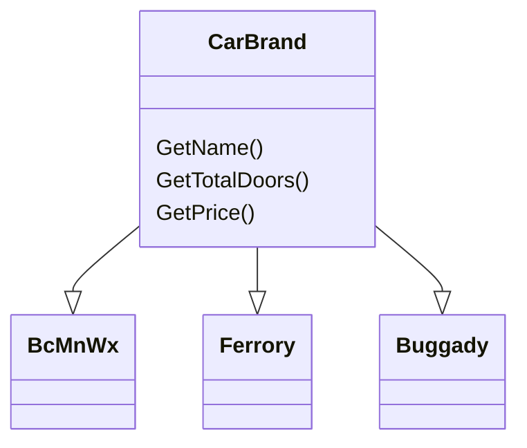

>Factory Design Pattern is not similar with [Factory Method Design Pattern](/#) and the term can't be used interchangeably.
{: .prompt-info }
> **Factory Design Pattern** means "a class/object that are responsible to create another class/object", basically it's like a "**factory that creates new product**". The **factory class contain a method  that are responsible creating and returning a different object based on user's input**.
>
> In this design pattern, when creating an object/class, **client will not see the creation logic behind it and they will interact with the newly created object/class using interface/abstraction.**

## Real-time example

- To understand what factory design pattern is all about, real time example is needed and for this purposes an application will be created to show a details about the car's brand.
- Based on the diagram below, there's a three car's brand classes e.g. `BcMnWx`, `Ferrory` and `Buggady` these three classes are the subclasses of `CarBrand` superclass. The `CarBrand` superclass has three methods `getName()`, `getTotalDoors()` and `getPrice()`.  `BcMnWx`, `Ferrory` and `Buggady` subclasses have implemented all its superclass's methods.



> **Requirements:** User will be ask to select the car's brand, after user have selected the car's brand, application will process user's input and fetch the required information and display it to the user.

- For this application, two example of the implementation will be shown, **'Without Factory Design Pattern'** and **'With Factory Design Pattern'**.

### Example: Without Factory Design Pattern

- Below shows an `ICreditCard.cs` interface/abstract class that will be use to expose  the object `CarBrand` creation process.

```c#
// ICreditCard.cs
namespace FactoryDesignPattern
{
 public interface CarBrand
 {
  string GetName();
  int GetTotalDoors();
  double GetPrice();
 }
}
```

- Below shows a `BcMnWx.cs` class with the implementation of `CarBrand` interface.

```c#
// BcMnWx.cs
namespace FactoryDesignPattern
{
 class BcMnWx : CarBrand
 {
  public string GetName()
  {
   return "BcMnWx";
  }
 
  public int GetTotalDoors()
  {
   return "4";
  }

  public double GetPrice()
  {
   return "900.000"
  }

 }
}
```

- Below shows  a `Ferrory.cs` class with the implementation of `CarBrand` interface.

```c#
// Ferrory.cs
namespace FactoryDesignPattern
{
 class Ferrory : CarBrand
 {
  public string GetName()
  {
   return "Ferrory";
  }
 
  public int GetTotalDoors()
  {
   return "2";
  }

  public double GetPrice()
  {
   return "2900.000"
  }

 }
}
```

- Below shows a  `Buggady.cs` class with the implementation of `CarBrand` interface.

```c#
// Buggady.cs
namespace FactoryDesignPattern
{
 class Buggady : CarBrand
 {
  public string GetName()
  {
   return "Buggady";
  }
 
  public int GetTotalDoors()
  {
   return "2";
  }

  public double GetPrice()
  {
   return "18000.000"
  }

 }
}
```

- Below shows  a `Program.cs`  class, where the app will ask user to choose the car's brand but for this case, input value have been manually added for understandability & simplicity purposes.
- Based on the input value of the selected car's brand, instance of the three sub-classes e.g. `BcMnWx`, `Ferrory` and `Buggady` implementation classes can be created.

```c#

// Program.cs
using System;

namespace FactoryDesignPattern
{
 class Program
 {
  static void Main(string[] args)
  {
   // User's input will be hardcoded manually
   // for understandability purposes
   string carType = "BcMnWx";

   CarBrand carDetails = null;
   
   if (carType = "BcMnWx")
   {
    carDetails = new BcMnWx();
   }
   else if (carType = "Ferrory")
   {
    carDetails = new Ferrory();
   
   }
   else if (carType = "Buggady")
   {
    carDetails = new Buggady();
   
   }

   if (carDetails != null)
   {
    Console.WriteLine("Car Type : " + carDetails.GetName());
    Console.WriteLine("Car Total Doors : " + carDetails.GetTotalDoors());
    Console.WriteLine("Car Price : " + carDetails.GetPrice());
   
   }
   else 
   {
    Console.Write("Invalid Car Type!");
   }
   
   Console.ReadLine();
  }
 }
}
```

- Below is the final output

```md
 Car Type : BcMnWx
 Car Total Doors : 4
 Car Price : 900.000
```

#### Without Factory Design Pattern - Implementation's Problem

- **Tightly Coupled** between classes; `Program.cs` and sub-classes (`BcMnWx`, `Ferrory` and `Buggady`).
- If want to add new car's brand, user need to add another `if-else` condition block and this is against the [Open-Closed Principle (OCP)](/posts/solid-ocp/)  which will deter the development progress and also testing process.

### Example: With Factory Design Pattern

- Below shows an `ICreditCard.cs` interface/abstract class that will be use to expose the object `CarBrand` creation process.

```c#
// ICreditCard.cs
namespace FactoryDesignPattern
{
 public interface CarBrand
 {
  string GetName();
  int GetTotalDoors();
  double GetPrice();
 }
}
```

- Unlike before, instead of exposing the object `CarBrand` creation process logic directly in `Program.cs`, this time `CarFactory.cs` will be created and this class is responsible to store all the object `CarBrand` creation process logic  or instantiation process and will act as mediary or abstraction for the classes that want to create and fetch car brand object details.

> **Important:** Please be aware that the below snippet violates [Open-Closed Principle (OCP)](/posts/solid-ocp/) where you still have to add a new `if-else` condition block if there's new car brand to be added.
>
```c#

namespace FactoryDesignPattern
{
 class CarFactory
 {
  public static CarBrand GetCarBrand(string carType)
  {
   CarBrand carDetails = null;
   
   if (carType = "BcMnWx")
   {
    carDetails = new BcMnWx();
   }
   else if (carType = "Ferrory")
   {
    carDetails = new Ferrory();
   }
   else if (carType = "Buggady")
   {
    carDetails = new Buggady();
   }
   return carDetails;
  }
 }
}
```

- Now, `Program.cs` can refer to `CarFactory.cs` to create car's brand object, below is the example of the implementation.

```c#

// Program.cs
using System;

namespace FactoryDesignPattern
{
 class Program
 {
  static void Main(string[] args)
  {
   // User's input will be hardcoded manually
   // for understandability purposes
   CarBrand carDetails = CarFactory.GetCarBrand("Buggady");

   if (carDetails != null)
   {
    Console.WriteLine("Car Type : " + carDetails.GetName());
    Console.WriteLine("Car Total Doors : " + carDetails.GetTotalDoors());
    Console.WriteLine("Car Price : " + carDetails.GetPrice());
   }
   else 
   {
    Console.Write("Invalid Car Type!");
   }
   
   Console.ReadLine();
  }
 }
}
```

- Below is the final output:

```md
 Car Type : Buggady
 Car Total Doors : 2
 Car Price : 18000.000
```

#### With Factory Design Pattern - Implementation's Problem

- **Tightly Coupled** between the factory `CarFactory.cs` and sub-classes (`BcMnWx`, `Ferrory` and `Buggady`).
- This implementation violates [Open-Closed Principle (OCP)](/posts/solid-ocp/), where user have to add new `if-else` condition block each time there is new car brand. This occurred at `CarFactory.cs`.
- To overcome both of these problem within implementation of Factory Design Pattern refer **[Factory Method Design Pattern](/#)**.

## When to use Factory Design Pattern

- When extension of an object into a subclasses is needed.
- When don't know the exact sub-classes to create, often time relies on input from user/database.
- When the derived sub-classes have high possibilities of changes in the future and the clients remains unchanged.

---

## Sources

1. [What is Factory Design Pattern](https://dotnettutorials.net/lesson/factory-design-pattern-csharp/)
