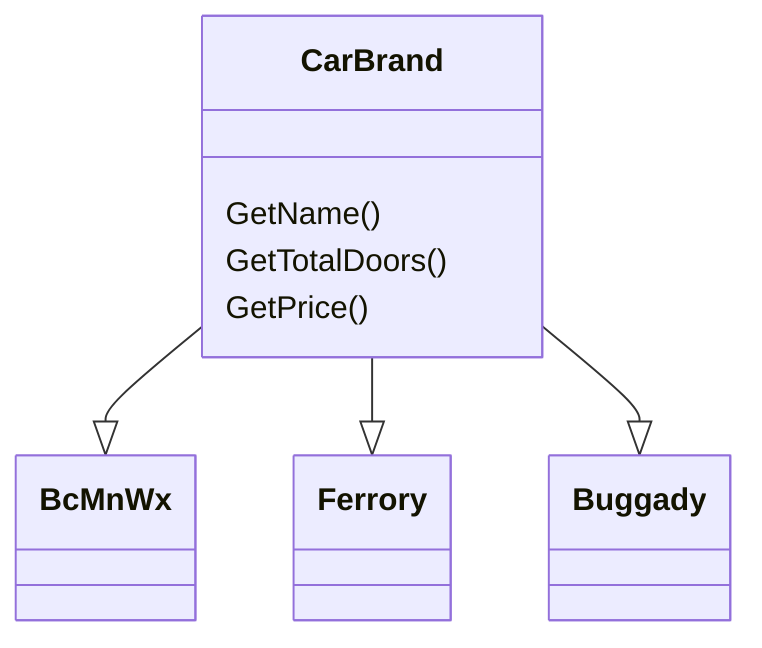

> Factory Method Design Pattern is not similar with [Factory Design Pattern](/posts/factory-design-pattern/) and the term can't be used interchangeably.
{: .prompt-info }
> **Factory Method Design Pattern** means "define a interface/abstract class that used for creating an object/class, but let the subclasses decide which class to instantiate". This pattern is needed when we want to create an object/class without exposing the creation logic to the client.

## Real-time example

- Based on the diagram below, there's a three car's brand classes e.g. `BcMnWx`, `Ferrory` and `Buggady` these three classes are the subclasses of `CarBrand` superclass. The `CarBrand` superclass has three methods `getName()`, `getTotalDoors()` and `getPrice()`.  `BcMnWx`, `Ferrory` and `Buggady` subclasses have implemented all its superclass's methods.



### Element Interface Class

- Below shows an `ICreditCard.cs` interface/abstract class that will be use to expose  the object `CarBrand` creation process.

```c#
// ICreditCard.cs
namespace FactoryMethodDesignPattern
{
 public interface CarBrand
 {
  string GetName();
  int GetTotalDoors();
  double GetPrice();
 }
}
```

### Concrete Elements Class

- Below shows a concrete 'element' class containing the car's brands interface which responsible providing `BcMnWx`, `Ferrory` and `Buggady` classes/objects that uses `CarBrand` interface for the creation of object/class's instances.

```c#
// MakeElement.cs
namespace FactoryMethodDesignPattern
{
 public class BcMnWx : CarBrand
 {
  public string GetName()
  {
   return "BcMnWx";
  }
  public int GetTotalDoors()
  {
   return "4";
  }
  public double GetPrice()
  {
   return "900.000"
  }
 }

 public class Ferrory : CarBrand
 {
  public string GetName()
  {
   return "Ferrory";
  }
  public int GetTotalDoors()
  {
   return "2";
  }
  public double GetPrice()
  {
   return "2900.000"
  }
 }

 public class Buggady : CarBrand
 {
  public string GetName()
  {
   return "Buggady";
  }
  public int GetTotalDoors()
  {
   return "2";
  }
  public double GetPrice()
  {
   return "18000.000"
  }
 }
}
```

### Abstract Creator Class

- The snippet shows an abstract creator class called `CarBrandFactory` this class also known as the `Creator` class where it will declare the `Factory Method` which will create the object/class and return it to the client.
- `CarBrandFactory` class contains two methods, one abstract method `MakeCar()` and one concrete method `CreateCar()`. Inside `CreateCar()`,  `MakeProduct()` method of the subclass is called which will create the element instance and return that instance.
- This **Abstract Creator** will act as **Factory Class** for creating the object and it declares a **Public Factory Method** `CreateCar()` which return an object type `CreateBrand`.

```c#
// CarBrandFactory.cs
public abstract class CarBrandFactory
{
 protected abstract CarBrand MakeCar();

 public CarBrand CreateCar()
 {
  return this.MakeCar();
 }
}
```

### Concrete Creator Class

- **Concrete Creator**'s  object will overrides the **Factory Method** `this.MakeCar()` from **Abstract Creator Class** to return an instance of a element product. Based on the number of the car brand, a classes that implement `CarBrandFactory` is created and this classes will responsible to create element's instances and return it to the client.

```c#
// ConcreteCreator.cs
namespace FactoryMethodDesignPattern
{
 public BcMnWxFactory : CarBrandFactory
 {
  protected override CarBrand MakeCar()
  {
   CarBrand car = new BcMnWx();
   return car;
  }
 }
 
 public FerroryFactory : CarBrandFactory
 {
  protected override CarBrand MakeCar()
  {
   CarBrand car = new Ferrory();
   return car;
  }
 }

 public BuggadyFactory : CarBrandFactory
 {
  protected override CarBrand MakeCar()
  {
   CarBrand car = new Buggady();
   return car;
  }
 }
}
```

### Client Code

- Below shows a snippet on how to create an instance of an element.

```c#
using System;
namespace FactoryMethodDesignPattern
{
 class Program
 {
  static void Main(string[] args)
  {
   CarBrand cardBrand = new BcMnWxFactory().CreateCar();
   if (carBrand != null) 
   {
    Console.WriteLine("Car Type : " + cardBrand.GetName());
    Console.WriteLine("Car Total Doors : " + cardBrand.GetTotalDoors());
    Console.WriteLine("Car Price : " + cardBrand.GetPrice());
   }
   else 
   {
    Console.WriteLine("Invalid Car Brand!");
   }
   Console.ReadLine();
  }
 }
}
```

- Below is the final output:

```md
 Car Type : BcMnWx
 Car Total Doors : 4
 Car Price : 900.000
```

---

## Sources

1. [What is Factory Method Design  Pattern](https://dotnettutorials.net/lesson/factory-method-design-pattern-csharp/)
